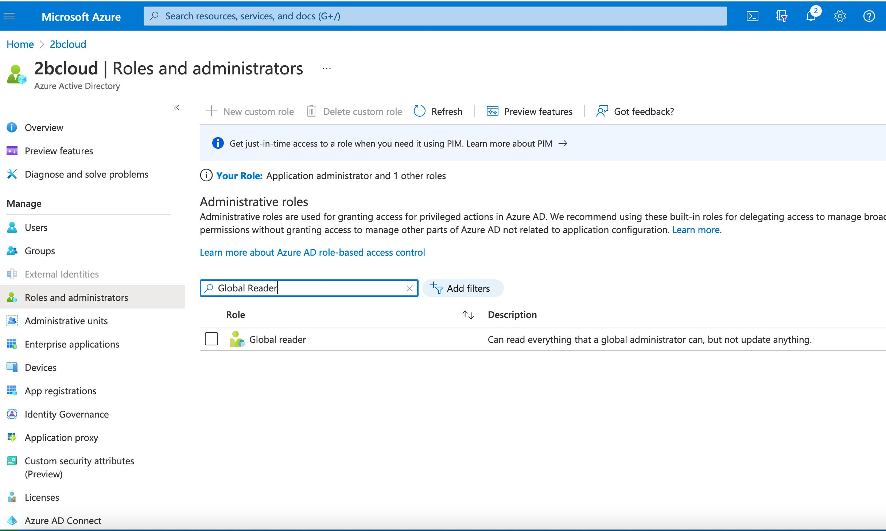
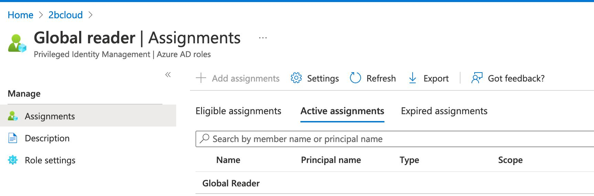
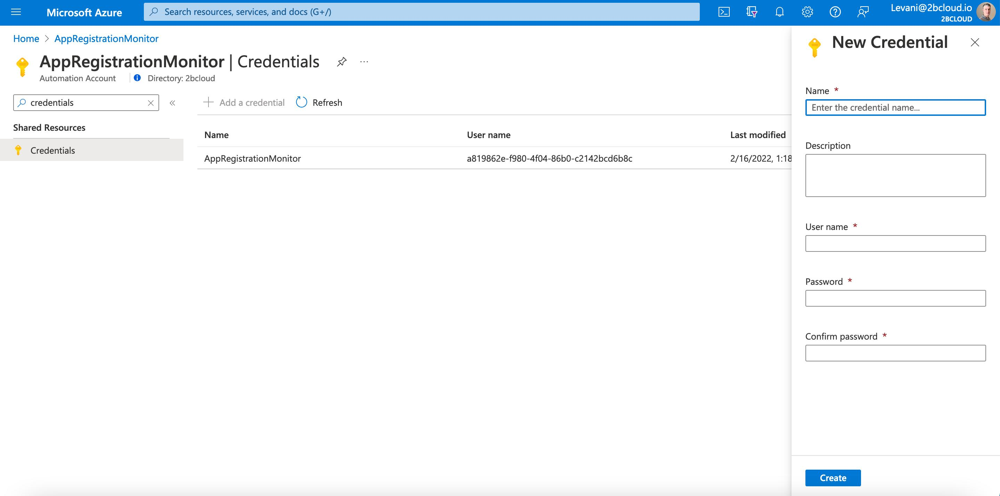
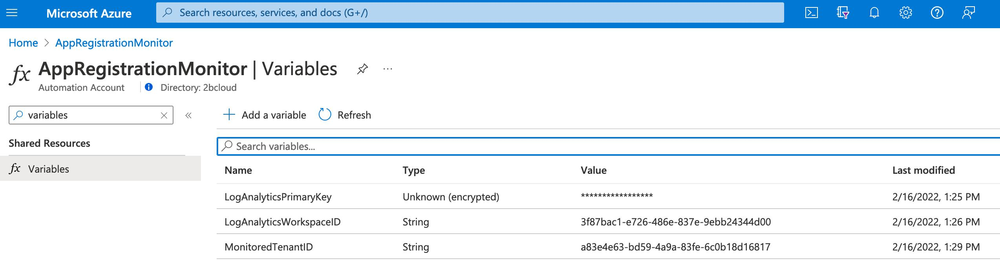
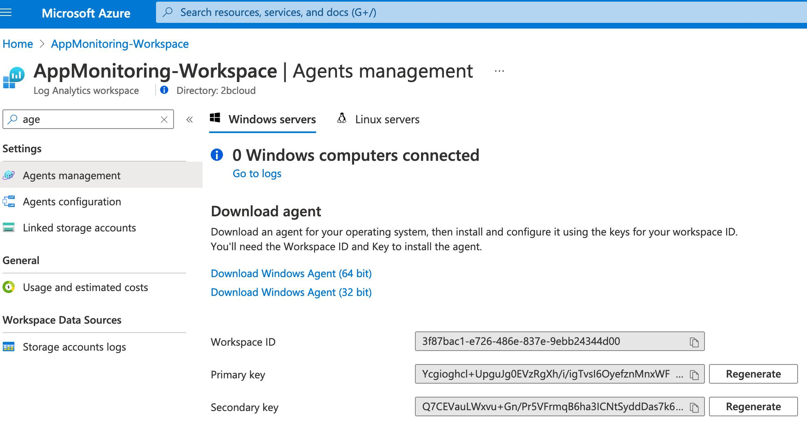
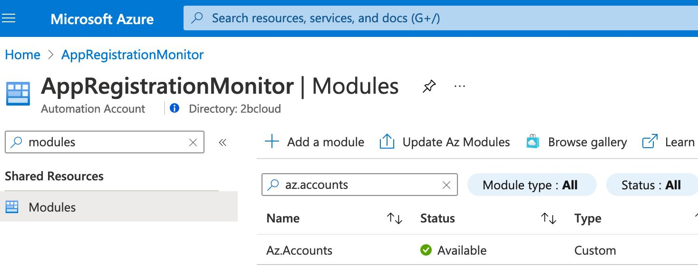
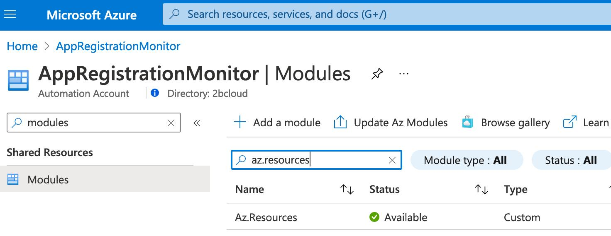
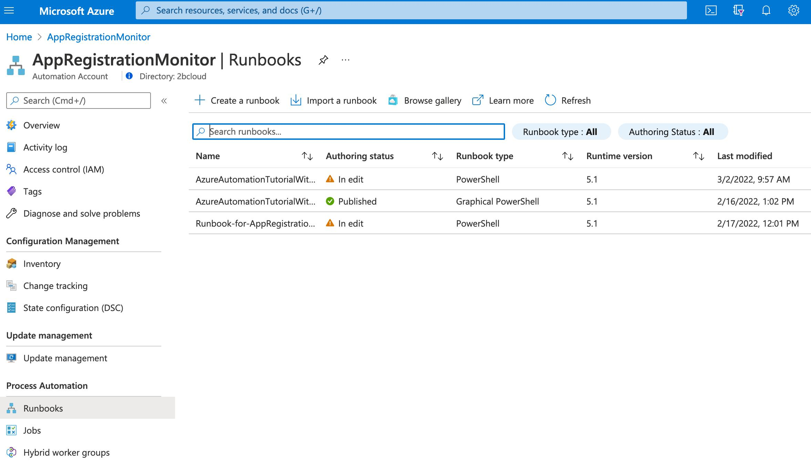
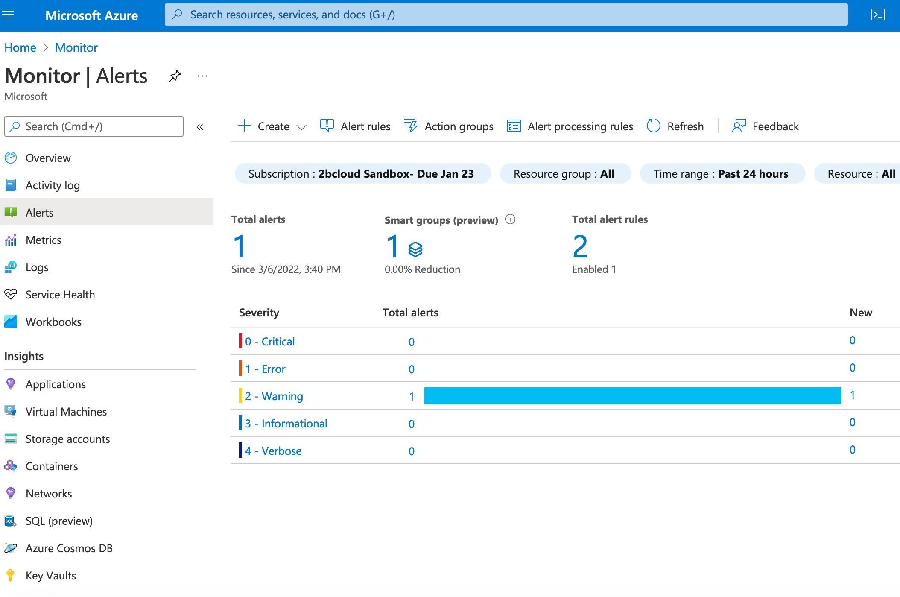

# About the project

The project is to deploy the Microsoft Azure Resource Manager ( ARM ) templates
so that the tenant is been monitored for application registration monitoring 
(hence the repository name `arm-arm` means: `Azure Resource Manager` - `Application Registration Monitoring` ).

## Solution Architecture

## Implementation

First, I will explain the implementation on an Azure Portal website and only then I will
describe how to implement it from the ARM side.

### Creating SPN

SPN stands for `Service Principal Name` and we need to create it in Azure Portal in order to monitor
other SP keys for expiration in the same tenant.

Steps:
1. Go to the `App Registrations` -> `New Registration` from the Azure Portal and type in the name `AppRegistrationMonitor`.
   For `Account Types` choose `Accounts in this organizational directory only`, leave blank `Redirect URL` and click `Register`.
   1. When the creation process completes you should navigate to the `Overview` (if you're not on that page already) and 
       copy the `Application ( client ) ID` key and save it in a notepad. 

       
       
   2. On the same page navigate to `Certificates & Secrets` on the left and click `New Client Secret` and copy the `Value`:

      
   
2. Navigate to `Azure Active Directory` -> `Roles And Administrators` -> `Global Reader`.

   
   

   After clicking it you should get something like this:

   

   Choose `Add Assignments`, select the `AppRegistrationMonitor` account and click OK.

3. Navigate to the `Azure Automation Account` -> `AppRegistrationMonitor` -> `Credentials` -> `Add A Credential` 

   
   

    * **Name**: AppRegistrationMonitor
    * **Description**: Optional
    * **User name**: Paste the `Application Client ID` from above step 
    * **Password**: Paste the `Secret Value` from above step
    * **Confirm Password**: Paste the `Secret Value` from above step
    * **Click Create**

### Variables

We need three variables for our newly created Automation Account:

1. LogAnalyticsPrimaryKey  - To obtain the key, navigate to the 
   `Log Analytics Workspaces` -> `AppMonitoring-Workspace` ->`Agents Management` and copy the `Primary Key` field.

   

2. LogAnalyticsWorkspaceID - To obtain the key, navigate to the 
   `Log Analytics Workspaces` -> `AppMonitoring-Workspace` ->`Agents Management` and copy the `Workspace ID` field.

   

3. MonitoredTenantID - To obtain the key, navigate to the `AppRegistrationMonitor` SPN in `Azure Active Directory`. 
   On the `Overview` page you will find the `Directory (tenant) ID`. 

### AZ Modules

Before proceeding further we need to download AZ Modules in order to be able to properly execute Runbooks.

1. Navigate to your `Automation Account` -> `AppRegistrationMonitor` -> `Modules`, search for and select `Az.Accounts`, click `Import`.
   
   

2. Search for and select `Az.Resources`, click `Import`.

   

### Creating and Configuring Runbook

Runbook is an essential part of this workflow. It will contain the custom created PowerShell script which makes sure
to populate the workspace tables.

Navigate to your `Automation Accounts` -> `AppRegistrationMonitor` -> `Runbooks`

 

Click `+ Create a runbook`, give the runbook a name, select `PowerShell` as `Runbook type`, choose any version for 
`Runtime Version` and click `Create`.
Copy the PowerShell script from [runbook.ps1](./runbook.ps1) into the Runbook. Click `Publish` and `Yes` to confirm. 
From the account Overview, click `Start` to run the task and confirm it completes with no errors.
Within the Runbook, go to `Schedules` and `Add/create` a schedule that runs this script periodically.

   
### Azure Monitor Alert

To create the Azure monitor alert rule, navigate to `Monitor` -> `Alerts` 

First, we need to create an `Action Group`: Go to the `Action Groups` and click `+ Create`, choose subscription, resource group,
provide name and short names. Choose the notification type you prefer ( email / SMS / Push ) and click `Review + Create`.

Go back to the monitor alerts page and now click `Alert Rules`. Click `+ Create` and follow on screen process:
* For `Scope` select Log Analytics Workspace as the resource ( in this case it should be `AppMonitoring-Workspace`).
* For `Condition` select `Custom Log Search` and paste the [Kusto Query](./kusto-query) inside the text field.
* For `Actions` choose the previously created action.
* Click `Review + Create`
  
This is it. You should now receive emails (or SMS or PUSH notifications ) about expring SP keys.

